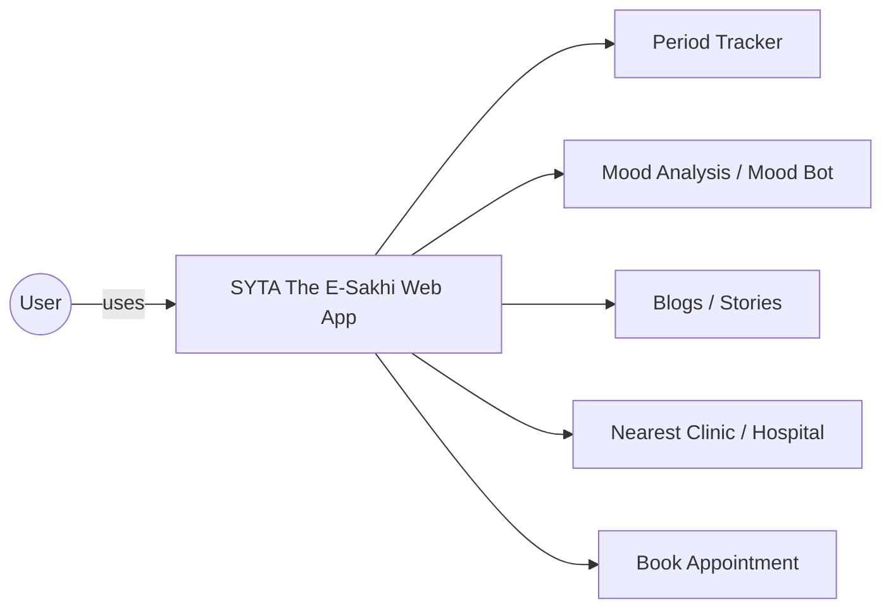
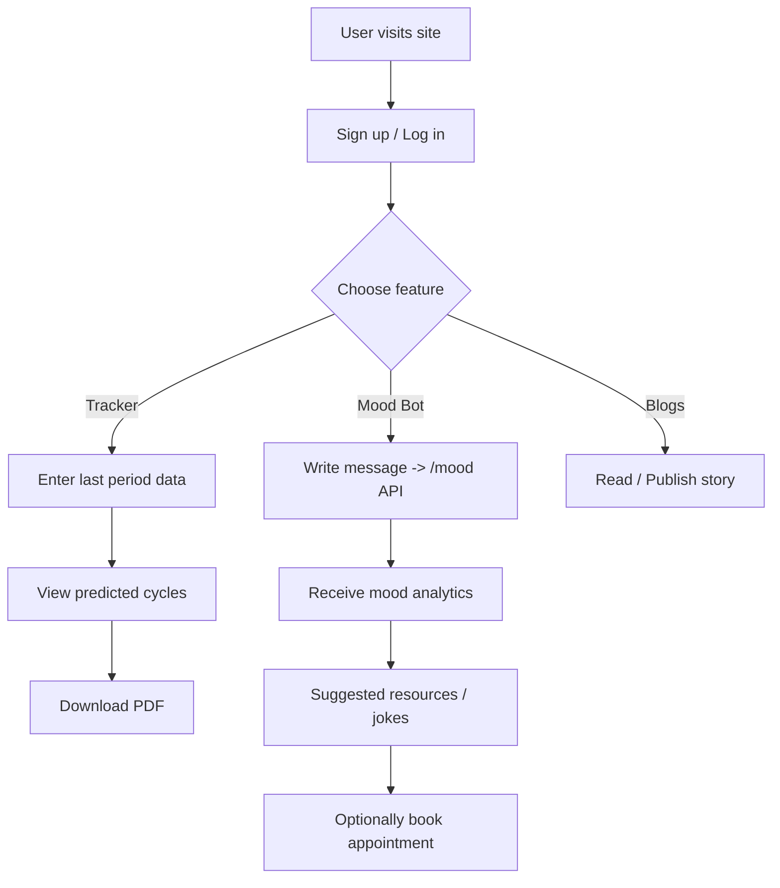

# SYTA The E-Sakhi

SYTA The E-Sakhi is a lightweight web platform combining a React frontend and a FastAPI backend with a small NLTK-based mood-tracker ML service.

## What this repository contains
- Frontend: React app in `src/` (production-ready PWA files in `public/`).
- Backend: FastAPI app in `app/` providing a `/mood` prediction endpoint using a small NLTK-based model.
- ML helpers: `Mood_tracker/` contains training and model utils and weights files.
- Docker: `Dockerfile` and `docker-compose.yaml` to run the API in a container.

## Quick links
- Backend entrypoint: `app/app.py`
- Requirements: `requirements.txt`
- Dockerfile: `Dockerfile`
- Docker Compose: `docker-compose.yaml`

## Prerequisites
- Python 3.10+
- Node.js + npm (for frontend dev)
- Docker & Docker Compose (optional, for containerized run)

## Run backend locally (development)
1. Create and activate a virtual environment:

```bash
python3 -m venv .venv
source .venv/bin/activate
```

2. Install Python dependencies:

```bash
pip install -r requirements.txt
```

3. Start the FastAPI app (dev reload):

```bash
python -m uvicorn app.app:app --reload --host 0.0.0.0 --port 8000
```

4. Health check: open http://localhost:8000/ to see a welcome message. Use POST `/mood` to send text and receive predictions.

Notes: The app uses NLTK tokenizers; if you run locally you may need to run `python -m nltk.downloader punkt` once.

## Run frontend locally (development)
1. From the repo root:

```bash
cd src
npm install
npm start
```

The frontend dev server defaults to `http://localhost:3000` and can be configured to call the backend at port 8000.

## Deploying to Vercel
1. Connect this GitHub repository to Vercel and set the project to use the repository root.
2. Build command: `npm run build`
3. Output directory: `build`
4. Add an environment variable `REACT_APP_API_URL` pointing to your backend URL (after backend is deployed).

## Suggested GitHub description & README blurb
- Short description: "SYTA The E-Sakhi — React frontend + FastAPI mood-tracker with Docker support."
- Blurb: "SYTA The E-Sakhi is a lightweight web application combining a React-based frontend and a FastAPI backend that includes a small NLTK-based mood prediction service. The backend exposes a `/mood` endpoint which accepts text and returns predicted mood analytics. This repository includes `Dockerfile` and `docker-compose.yaml` for one-command containerized runs, plus instructions to run the frontend and backend locally for development."

---

## Tech stack
- Frontend: React (create-react-app), styled-components, MUI
- Backend: FastAPI, Uvicorn, NumPy, NLTK
- Data/model: small NLTK tokenization + JSON weights
- DevOps: Docker, Docker Compose, Vercel (frontend)

## Use case diagram


## User flow


## Deploying frontend to Vercel (force-deploy from your machine)
Two options: connect GitHub repo to Vercel (recommended) or deploy from CLI.

1) GitHub (recommended)
- In Vercel, click "Import Project" → select GitHub repo → set Build Command `npm run build` and Output Directory `build` → add Environment Variable `REACT_APP_API_URL` with your backend URL (once backend is deployed) → Deploy.

2) Vercel CLI (quick, from your machine)

```bash
npm i -g vercel
vercel login
cd /path/to/repo
vercel --prod
# Add env var for frontend to talk to backend:
vercel env add REACT_APP_API_URL production
```

Notes: Vercel will build the React app and host the static files. The backend (FastAPI + ML weights) should be hosted separately (Render, Railway, or Docker-enabled host). After backend is live, set `REACT_APP_API_URL` in Vercel to point to the backend base URL.

If you want, I can create a git branch with these README and rename changes and show the exact `git` commands to push — tell me to `create-branch` and I'll prepare the commands.
